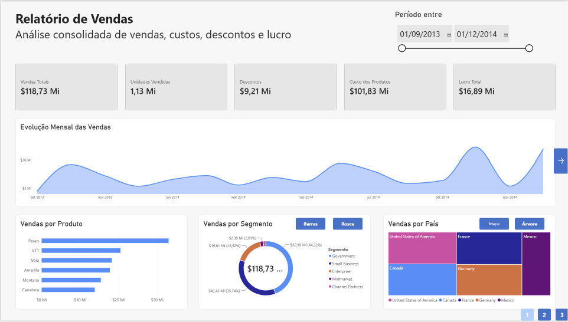
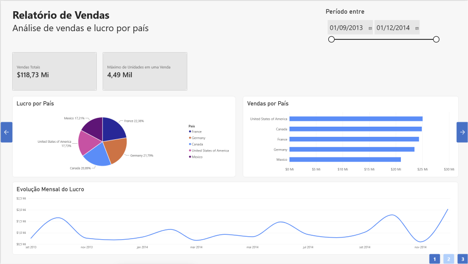
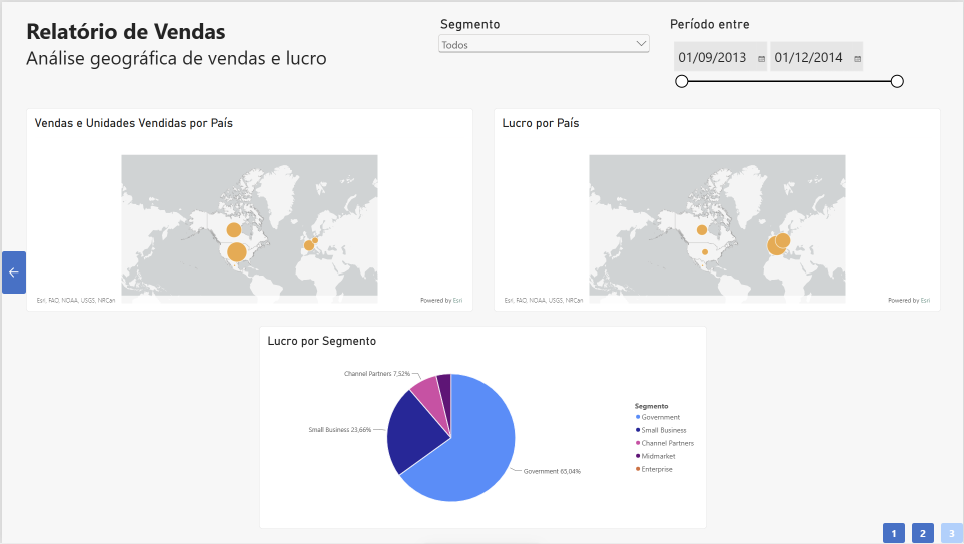

# Relatório de Vendas no Power BI

> **Módulo 2 - Fundamentos de Business Intelligence**
>
> [Voltar à visão geral da Formação Power BI Analyst](../README.md)

Projeto desenvolvido como desafio prático da Formação Power BI Analyst da DIO. O trabalho utiliza a base `Financial Sample.xlsx` para construir um relatório interativo de vendas com três páginas de análise.

## Objetivo do desafio

Reproduzir e aprimorar duas páginas apresentadas durante o curso e desenvolver uma terceira página com foco geográfico. O projeto exercita a preparação dos dados, a seleção de visuais e a criação de interações no Power BI.

## Base de dados

A base contém 700 registros de vendas referentes a 2013 e 2014, distribuídos por países, produtos e segmentos. Entre os campos utilizados estão:

- `Sales`;
- `Units Sold`;
- `Discounts`;
- `COGS`;
- `Profit`;
- `Country`;
- `Product`;
- `Segment`;
- `Date`.

A planilha utilizada está disponível em [`data/financial-sample.xlsx`](data/financial-sample.xlsx). A fonte original foi o [repositório de apoio da instrutora Juliana Mascarenhas](https://github.com/julianazanelatto/power_bi_analyst).

## Preparação dos dados

No Power Query, foram realizadas verificações de tipos e valores vazios, padronização do nome da coluna de vendas e transformação de `Units Sold` em número inteiro por arredondamento para baixo. Os campos financeiros foram formatados em dólar.

## Páginas do relatório

### 1. Visão geral de vendas

Apresenta os principais indicadores do conjunto de dados, a evolução mensal das vendas e comparações por produto, segmento e país. A página inclui filtro de período, botões e indicadores para alternar entre barras e rosca, além de mapa de árvore e mapa ArcGIS.



### 2. Vendas e lucro por país

Compara vendas e lucro entre os países, apresenta o máximo de unidades em uma venda e acompanha a evolução mensal do lucro.



### 3. Análise geográfica

Página desenvolvida especificamente para o desafio. Contém dois mapas de bolhas, um dimensionado pelas vendas e outro pelo lucro, além de um gráfico de pizza com o lucro por segmento. Os mapas respondem aos filtros de período e segmento.



## Recursos implementados

- cartões com indicadores de vendas, unidades, descontos, custos e lucro;
- filtros de período sincronizados entre as páginas;
- segmentação por segmento;
- gráficos de área, barras, pizza, rosca e mapa de árvore;
- mapas ArcGIS com bolhas proporcionais;
- dicas de ferramentas;
- indicadores e botões para alternância de visuais;
- navegação entre as três páginas.

## Decisões e limitações

Os visuais clássicos de mapa e mapa preenchido estavam desabilitados pelas configurações administrativas da organização. Por esse motivo, o projeto utiliza o **ArcGIS for Power BI**, que preserva a análise geográfica e o dimensionamento das bolhas.

O segmento `Enterprise` apresenta lucro total negativo. Gráficos de pizza não representam adequadamente valores negativos, embora o segmento permaneça na legenda. No ArcGIS, os prejuízos aparecem nas dicas de ferramentas em notação contábil, entre parênteses, enquanto o tamanho das bolhas representa a magnitude do valor.

## Arquivos

```text
modulo-02-fundamentos-bi/
├── README.md
├── dashboard/
│   └── relatorio-vendas-power-bi.pbix
├── data/
│   └── financial-sample.xlsx
└── images/
    ├── pagina-01-visao-geral-vendas.png
    ├── pagina-02-vendas-lucro-pais.png
    └── pagina-03-analise-geografica.png
```

O relatório completo pode ser baixado em [`dashboard/relatorio-vendas-power-bi.pbix`](dashboard/relatorio-vendas-power-bi.pbix).

## Aprendizados

O desafio permitiu aplicar o fluxo básico de BI, desde a obtenção e transformação dos dados até sua apresentação em um relatório interativo. Também evidenciou a importância de selecionar visuais compatíveis com a natureza das métricas, testar as interações e documentar limitações que influenciam a interpretação dos resultados.

## Autoria

**Natasha Sophie Pereira**

Setembro de 2026
